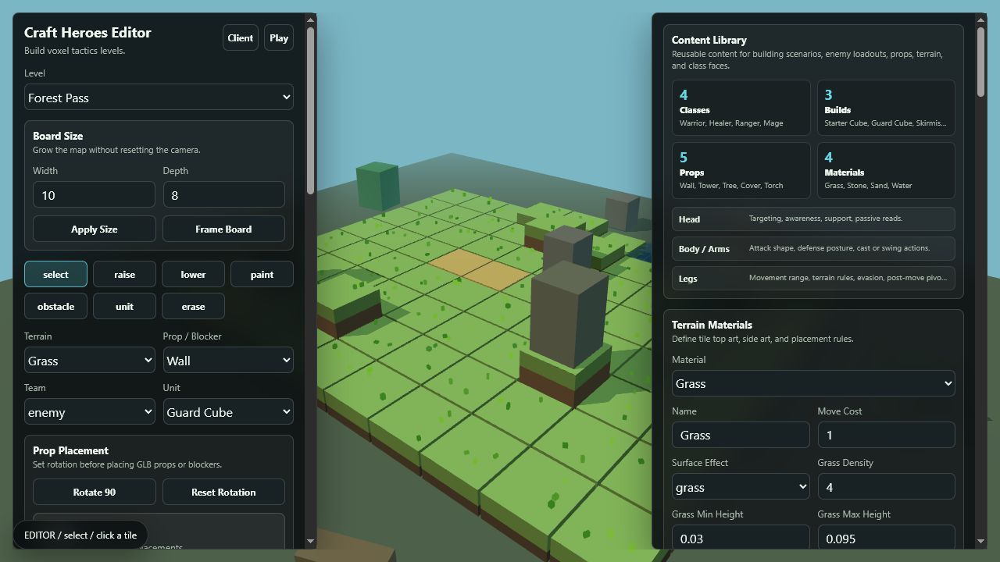
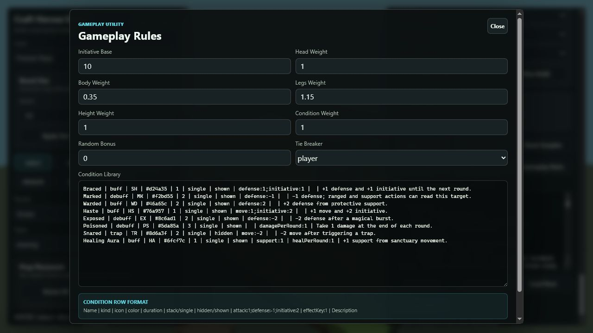
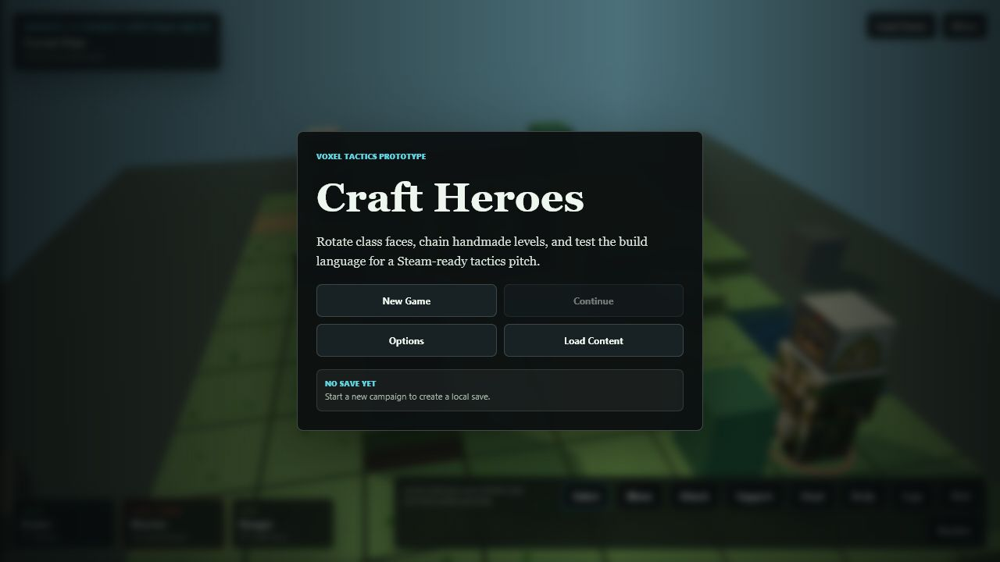
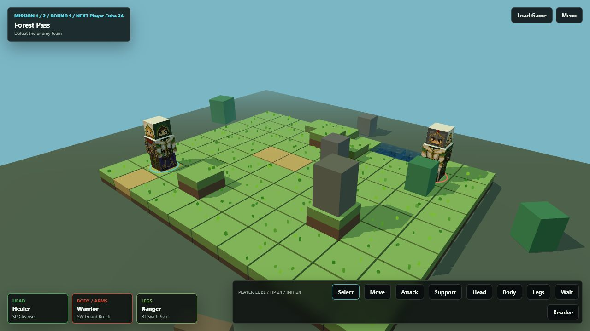

# Craft Heroes How-To Guide

Living guide for the Craft Heroes 3D tactics prototype and production editor.
Use this document as the main online manual for building levels, authoring
content, tuning gameplay rules, exporting campaigns, and testing the standalone
client.

Last updated: July 10, 2026

## Table Of Contents

- [Purpose](#purpose)
- [Quick Start](#quick-start)
- [Project Layout](#project-layout)
- [Core Game Concept](#core-game-concept)
- [Editor Overview](#editor-overview)
- [Building A Level](#building-a-level)
- [Terrain And Materials](#terrain-and-materials)
- [Props, GLB Models, And Lighting](#props-glb-models-and-lighting)
- [Characters, Classes, And Builds](#characters-classes-and-builds)
- [Gameplay Rules](#gameplay-rules)
- [Story Beats](#story-beats)
- [Campaign Flow](#campaign-flow)
- [Title Screen](#title-screen)
- [Exporting, Importing, And Saving](#exporting-importing-and-saving)
- [Client Play Guide](#client-play-guide)
- [Standalone PC Client](#standalone-pc-client)
- [Best Practices](#best-practices)
- [Current Feature Reference](#current-feature-reference)
- [Guide Maintenance Checklist](#guide-maintenance-checklist)

## Purpose

Craft Heroes is a playable 3D tactics prototype where modular cube heroes fight
on voxel terrain. The editor is intended to grow into a production content tool:
level building, campaign chaining, class/loadout authoring, rules tuning,
environment dressing, story moments, and eventual PC packaging.

This guide should answer:

- How do I build and test a level?
- What does every editor section do?
- How do I create terrain, props, classes, builds, and rules?
- How do I export content into the client?
- What practices keep content readable and easy to update?

## Quick Start

Install dependencies once:

```powershell
npm install
```

Run the editor and browser client locally:

```powershell
npm run dev
```

Open:

- Editor: `http://127.0.0.1:5173/`
- Client: `http://127.0.0.1:5173/client.html`

Build the normal web output:

```powershell
npm run build
```

Build the standalone client payload for an Electron shell:

```powershell
npm run build:client
```

## Project Layout

Important files and folders:

| Path | Purpose |
| --- | --- |
| `index.html` | Editor entry page. |
| `client.html` | Browser game client entry page. |
| `src/ui/EditorApp.ts` | Main editor UI and content authoring controls. |
| `src/ui/ClientApp.ts` | Playable campaign client, title screen, saves, controls, and story playback. |
| `src/render/LevelScene.ts` | Three.js board renderer, terrain, units, props, GLB loading, water, wind, lights, and camera. |
| `src/game/schema.ts` | Shared JSON schema types for levels, campaigns, classes, props, rules, story, and saves. |
| `src/game/content.ts` | Default sample campaign, classes, materials, props, units, and rules. |
| `src/game/levelOps.ts` | Level editing helpers and validation. |
| `public/assets/classes/` | Default segmented class art, one PNG per class section. |
| `docs/desktop-client.md` | Notes for wrapping the client with Electron/Steamworks. |
| `docs/craft-heroes-guide.md` | This living how-to guide. |

## Core Game Concept

Each unit is a cube hero with three independently rotating sections:

| Section | Primary Purpose | In-Game Meaning |
| --- | --- | --- |
| Head | Awareness, support, targeting, passive reads | Good reason to switch heads: initiative, support range, cleanse, scouting, line-of-sight behavior. |
| Body / Arms | Attacks, defense posture, weapon/cast actions | Good reason to switch bodies: attack shape, damage, defense, ranged shots, splash, melee reach. |
| Legs | Movement, terrain rules, evasion, post-move tactics | Good reason to switch legs: movement range, terrain crossing, mobility buffs, positioning identity. |

Each section has four faces. The face currently pointing forward determines the
class used for that section. If the player attacks, the body/arms face provides
the attack stats and attack effect. If the player supports, head/body support
effects matter. If the player moves, legs determine movement range and movement
effects.

## Editor Overview



The editor uses a two-sided layout:

- Left side: level selection, board size, edit tools, terrain/prop/unit placement,
  prop rotation, and selected level metadata.
- Right side: content library, terrain materials, environment settings, story
  beats, prop definitions, class definitions, unit builds, export/import, and
  campaign utilities.

The 3D board stays visible in the center. Camera controls use the Three.js orbit
camera: orbit, pan, and zoom around the board. Clicking a tile applies the active
tool or selects a unit/tile.

## Building A Level

Recommended first-pass workflow:

1. Pick a level from the **Level** dropdown.
2. Set **Width** and **Depth**, then choose **Apply Size**.
3. Use **raise** and **lower** to create height changes.
4. Use **paint** to apply terrain materials.
5. Place blockers and cover with **obstacle**.
6. Place player and enemy units with **unit**.
7. Add story beats and objective flow.
8. Use **Play** for an immediate editor-side playtest.
9. Export JSON and test in `client.html`.

Board controls:

| Control | What It Does | Best Practice |
| --- | --- | --- |
| Width | Number of tiles on the X axis. | Grow early before dressing the level. |
| Depth | Number of tiles on the Z axis. | Keep small prototype maps readable. |
| Apply Size | Resizes the map without intentionally resetting camera focus. | Check edge tiles after shrinking. |
| Frame Board | Re-centers the camera on the board. | Use after large size changes or loading a new map. |

Editing tools:

| Tool | What It Does | Notes |
| --- | --- | --- |
| select | Selects a tile or unit. | Use before assigning a selected tile to a story beat. |
| raise | Raises clicked terrain. | Height affects tactical readability and initiative scoring. |
| lower | Lowers clicked terrain. | Use for water beds, paths, and valleys. |
| paint | Paints the selected terrain material. | Paint after broad height shaping. |
| obstacle | Places the selected prop/blocker. | Uses current prop rotation. |
| unit | Places the selected unit template for the selected team. | Use player/enemy team selector first. |
| story | Lets the next clicked tile become a tile-enter story trigger. | Usually entered by pressing **Pick Tile** in Story Beats. |
| erase | Removes occupants from a tile. | Use for cleanup after layout changes. |

Placement selectors:

| Selector | Options In Current Prototype |
| --- | --- |
| Terrain | Grass, Stone, Sand, Water. |
| Prop / Blocker | Wall, Tower, Tree, Cover, Torch. |
| Team | player, enemy. |
| Unit | Starter Cube, Guard Cube, Skirmisher Cube. |

Prop placement controls:

| Control | What It Does |
| --- | --- |
| Rotate 90 | Rotates future placed props by another quarter turn. |
| Reset Rotation | Returns future prop placement rotation to 0 degrees. |

## Terrain And Materials

Terrain materials define how tiles look and how they behave. Materials are shared
content, so editing a material affects every tile using that material.

Material options:

| Option | Purpose |
| --- | --- |
| Name | Display name for the material. |
| Move Cost | Tactical movement cost for future movement rules. |
| Surface Effect | `solid`, `grass`, or `water`. |
| Grass Density | Number of decorative grass voxels on grass surfaces. |
| Grass Min Height | Minimum grass voxel height. |
| Grass Max Height | Maximum grass voxel height. |
| Grass Colors | Up to three color variants for grass voxels. |
| Top Color | Fallback top color if no top texture is uploaded. |
| Side Color | General fallback side color. |
| Side Cap Color | Side color for the top/cap block face. |
| Side Full Color | Side color for full-height lower block faces. |
| Side Half Color | Side color for half-height block faces. |
| Top Image | Optional texture for the tile top. |
| Side Image | Optional general side texture. |
| Side Cap Image | Optional side texture with top grass/lip detail. |
| Side Full Image | Optional pure lower-side texture. |
| Side Half Image | Optional texture for half-height exposed sides. |
| Top Rule | Author notes for what top art should look like. |
| Side Rule | Author notes for cap/full/half side art behavior. |
| Blocks Line Of Sight | Whether the terrain material should block sight in future rules. |

Current rendering behavior:

- Tile top textures are randomly rotated by 90, -90, or 180 degrees to reduce
  obvious tiling repetition.
- Grass is rendered as small voxel clumps instead of thin blades, so it does not
  fight the cube characters visually.
- Water is stylized with depth/murkiness, a base ground layer underneath, and
  simple underwater dressing.
- Terrain sides avoid using a single stretched texture for every case. Cap,
  full, and half side variants exist so grass can show a green lip only on the
  topmost exposed side while lower dirt blocks stay clean.

Best practices for terrain art:

- Use low-contrast top textures. The grid, units, and props need to stay readable.
- Keep side textures tileable vertically and horizontally.
- For grass, make `sideCap` include the green lip and make `sideFull` pure dirt.
- For water, build a visible bed underneath before placing water tiles.
- Avoid making grass too tall. It should dress the board, not hide legs.

## Props, GLB Models, And Lighting

Props can be simple editor boxes or uploaded GLB models.

Prop definition options:

| Option | Purpose |
| --- | --- |
| Name | Display name for the prop. |
| Role | `blocker`, `cover`, or `decor`. |
| Asset Kind | `box` or `glb`. |
| Color | Fallback box color. |
| Texture | Optional image texture for box props. |
| GLB Model | Optional uploaded `.glb` model. |
| Fit Model To Tile | Scales imported GLB content to fit roughly one tile. |
| Width | Box fallback width. |
| Height | Box fallback height. |
| Depth | Box fallback depth. |
| Blocks Movement | Prevents units from moving onto the tile. |
| Blocks Line Of Sight | Marks the prop as a sight blocker for tactical rules. |
| Cover Bonus | Numeric cover value for future defense/LOS rules. |
| Wind Effect | Allows the prop/model to sway with environment wind. |
| Emits Light | Enables a point light and glow marker. |
| Light Color | Color of emitted light. |
| Light Intensity | Brightness of emitted light. |
| Light Range | Radius/distance of emitted light. |
| Light Offset Y | Fallback vertical light position when no GLB marker exists. |
| Notes | Freeform tags or author notes. |

GLB light marker naming convention:

If a prop has **Emits Light** enabled, the renderer looks for up to four GLB
objects whose names contain one of these tokens:

```text
chlight, light, lightpoint, emit, emitter, emissive, ember, flame, glow
```

Examples:

```text
Torch_Ember
Lantern_Glow
CHLight_Flame_01
```

When a marker is found, only that marker area is treated as the light source.
The marker material receives emissive coloring, and the point light is placed at
the marker position. If no marker is found, the prop uses `Light Offset Y`.

Best practices for props:

- Use `decor` for visual dressing that should not block play.
- Use `cover` for tactical objects that can shape attacks without fully blocking
  movement.
- Use `blocker` for walls, trees, towers, and terrain-like obstructions.
- Keep imported models centered around their origin when possible.
- Prefer one tile per tactical prop. Use surroundings for large scenic dressing.
- Name light-emitting submeshes clearly in Blender before export.

## Environment And Surroundings

Environment options:

| Option | Purpose |
| --- | --- |
| Sky | Scene background color. |
| Fog | Fog color. |
| Ground | Color of the large surrounding ground plane. |
| Ground Texture | Optional image texture for the surrounding ground. |
| Ambient | Hemisphere/ambient feel. |
| Sun | Directional sun intensity. |
| Wind Strength | Strength of grass/foliage movement. |
| Wind Speed | Speed of grass/foliage movement. |

Background GLB options:

| Option | Purpose |
| --- | --- |
| Background GLB | A large model that surrounds the map. |
| Model Scale | Manual scale multiplier. |
| Rotation | Manual rotation in radians. |
| Vertical Offset | Moves the model up/down. |
| Fit Around Map | Scales/positions the model relative to the level footprint. |
| Update Background | Applies changes. |
| Clear Background | Removes the background model. |

Surrounding props:

| Option | Purpose |
| --- | --- |
| Surround X | X coordinate, can be outside the board. |
| Surround Z | Z coordinate, can be outside the board. |
| Rotation | Rotation in radians. |
| Scale | Prop scale multiplier. |
| Add Surrounding Prop | Adds the currently selected prop as scenery. |
| Clear Surroundings | Removes all surrounding props. |

Best practices:

- Use background GLBs for skyline, cliffs, caves, ruins, or large scenic frames.
- Use surrounding props for repeated trees, rocks, walls, tents, and torches.
- Night scenes should lower ambient/sun and use torch/light props for local focus.
- Keep combat-space blockers on the board and non-combat scenery outside it.

## Characters, Classes, And Builds

Craft Heroes separates class definitions from unit builds.

Class definitions answer: what does this class face do?

Unit builds answer: which four class faces are assigned to each section of this
specific cube?

Class section fields:

| Field | Purpose |
| --- | --- |
| Section Image | PNG used on that class/section face. |
| Attack | Offensive value used mainly by body/arms. |
| Defense | Defensive value used when that section is relevant. |
| Move | Movement value used mainly by legs. |
| Range | Targeting/support/attack reach. |
| Support | Healing, cleanse, buff, or utility strength. |
| Conditions | Human-readable notes for this section. |
| Abilities | One or more ability rows. |

Ability row format:

```text
Name | trigger | icon | color | description | effect
```

Current triggers:

| Trigger | Use |
| --- | --- |
| active | Manual or general action. |
| passive | Always-on read or modifier. |
| onMove | Movement-triggered effect. |
| onAttack | Attack-triggered effect. |
| onDefend | Defense-triggered effect. |
| onSupport | Support-triggered effect. |

Common effect tokens currently used:

| Effect Token | Meaning In Current Prototype |
| --- | --- |
| `apply:condition-id` | Applies a condition to the action target. |
| `applyOnAttack:condition-id` | Applies a condition during an attack from another section, usually head. |
| `cleanse:1` | Removes one debuff or trap from an ally. |
| `healAdjacent:3` | Heals an adjacent ally by the given amount. |
| `heal:3` | Heals an ally in support range by the given amount. |
| `damagePerRound:1` | Condition effect that damages each round. |
| `healPerRound:1` | Condition effect that heals each round. |

Some tokens are design notes for future implementation, such as `frontMelee`,
`heightAttack`, `ignoreTerrain`, `rangedAttack`, `coverBlocked`,
`splashRadius`, and `crossHeightStep`. Keep using them consistently so they can
be upgraded into full systems later.

Default classes:

| Class | Head | Body / Arms | Legs |
| --- | --- | --- | --- |
| Warrior | Braced Focus, high defense | Guard Break melee | Hold Line defense posture |
| Healer | Cleanse support | Mend and Warded support | Sanctuary Step support aura |
| Ranger | Scout Sight and Marked | Volley, Marked, Snared | Swift Pivot and Haste |
| Mage | Arcane Sight | Blast and Exposed | Blink Step |

Build workflow:

1. Choose or create a unit build.
2. Set HP.
3. Assign four class faces for head, body/arms, and legs.
4. Place the build as player or enemy.
5. In play, rotate sections independently to expose different class faces.

Best practices:

- Give every section a reason to rotate. Avoid classes where all value sits in
  the body.
- Heads should influence knowledge, targeting, support, initiative, or passive
  rules.
- Bodies should create distinct attack shapes and defense identities.
- Legs should change map interaction, not just add one point of movement.
- For enemies, create named builds for the scenario instead of reusing only the
  default templates.

## Gameplay Rules



Open **Gameplay Rules** from the editor utility buttons near Level Flow and Title
Screen.

Initiative options:

| Option | Meaning |
| --- | --- |
| Initiative Base | Flat base score for every unit. |
| Head Weight | Weight for head range/support values. |
| Body Weight | Weight for body attack/defense values. |
| Legs Weight | Weight for leg movement values. |
| Height Weight | Weight for current tile height. |
| Condition Weight | Weight for condition initiative modifiers. |
| Random Bonus | Deterministic round-based random bonus cap. |
| Tie Breaker | `player`, `enemy`, or `higherHp`. |

Current initiative formula:

```text
base
+ (head range + head support) * headWeight
+ (body attack + body defense) * bodyWeight
+ legs move * legsWeight
+ tile height * heightWeight
+ condition initiative * conditionWeight
+ random bonus
```

Condition row format:

```text
Name | kind | icon | color | duration | stack/single | hidden/shown | modifiers | effect | description
```

Condition kinds:

| Kind | Use |
| --- | --- |
| buff | Positive effect. |
| debuff | Negative effect. |
| trap | Hidden or trap-like negative state. |
| status | Neutral state or special marker. |

Modifier format:

```text
attack:1;defense:-1;move:2;range:1;support:1;initiative:2
```

Default conditions:

| ID | Kind | Duration | Main Effect |
| --- | --- | --- | --- |
| `braced` | buff | 1 | +1 defense, +1 initiative. |
| `marked` | debuff | 2 | -1 defense. |
| `warded` | buff | 2 | +2 defense. |
| `haste` | buff | 1 | +1 move, +2 initiative. |
| `exposed` | debuff | 2 | -2 defense. |
| `poisoned` | debuff | 3 | 1 damage per round. |
| `snared` | trap | 2 | -2 move, hidden by default. |
| `healing-aura` | buff | 1 | +1 support, 1 heal per round. |

Best practices:

- Keep condition durations short until the combat loop has more turn structure.
- Use hidden traps sparingly; hidden states are harder to debug.
- Prefer explicit condition IDs in ability effects.
- Tune initiative weights after testing actual maps, not in isolation.
- Use rules as data whenever possible instead of hardcoding special cases.

## Story Beats

Story beats create dialog or full-screen story text at important moments.

Story options:

| Option | Values |
| --- | --- |
| Trigger | `levelStart`, `tileEnter`, `levelComplete`. |
| Presentation | `dialog` or `screen`. |
| Tile X | Tile coordinate for `tileEnter`. |
| Tile Z | Tile coordinate for `tileEnter`. |
| Title | Optional heading. |
| Speaker | Optional speaker label. |
| Avatar URL | Optional portrait image shown in the story window. |
| Avatar Upload | Uploads a local portrait into the story beat as a data URL. |
| Clear Avatar | Removes the current story portrait. |
| Pick Tile | Switches the board into story-picking mode; click the tile that should trigger the beat. |
| Use Selected Tile | Copies the currently selected board tile into the story beat. |
| Story Text | Body text shown to the player. |
| Add / Update Story Beat | Adds a new beat, or updates the beat currently loaded for editing. |
| Edit | Loads an existing beat back into the Story Beats form. |
| New Story Beat | Clears the form and exits edit mode. |

Best practices:

- Use `levelStart` for mission briefing or mood.
- Use `tileEnter` for ambushes, discoveries, tutorials, and environmental beats.
- Prefer **Pick Tile** or **Use Selected Tile** over typing coordinates by hand.
- Tile `0, 0` is the back-left board tile from the default editor camera. X runs
  left-to-right, and Z runs back-to-front.
- Use portraits for recurring speakers or tutorial callouts where the voice
  should be recognized quickly.
- Use `levelComplete` for transition text into the next mission.
- Keep dialog short during play. Use screen presentation for chapter breaks.

## Campaign Flow

Open **Level Flow** to edit linear campaign order.

Flow editor options:

| Option | Purpose |
| --- | --- |
| Campaign ID | Stable campaign identifier used by saves. |
| Campaign Title | Display title. |
| Start Level | First level loaded by New Game. |
| Level Name | Display name for each mission. |
| Level ID | Stable level identifier. |
| Next | Next level in the chain or Campaign End. |
| Add Blank Level | Creates a new level and appends it to the chain. |
| Apply Flow | Applies renamed levels and links. |
| Open | Opens a level for editing. |

Best practices:

- Rename level IDs before sharing/exporting a campaign.
- Keep IDs lowercase and descriptive, such as `forest-pass-01`.
- Use a single main path for now; branching can be introduced later.
- After changing flow, export the campaign JSON and test New Game in the client.

## Title Screen



Open **Title Screen** from the editor utility buttons.

Title options:

| Option | Purpose |
| --- | --- |
| Kicker | Small line above the main title. |
| Headline | Main title text. |
| Subtitle | Supporting copy. |
| Backdrop Level | Level used behind the title menu. |
| Orbit Speed | Camera orbit speed on title screen. |
| Camera Orbit | Toggles slow title camera orbit. |
| Mock Battle | Toggles looping preview FX over the title scene. |
| Open Backdrop Level | Jumps to that level for visual editing. |
| Apply Title Screen | Saves title settings into campaign data. |

Best practices:

- Treat the title screen as a small playable-looking diorama, not a static menu.
- Build a dedicated backdrop level if the first mission is too busy.
- Keep the title copy short and readable over the 3D scene.

## Exporting, Importing, And Saving

Editor buttons:

| Button | Use |
| --- | --- |
| Save Local | Saves current campaign, levels, builds, classes, materials, and props to browser local storage. |
| Reset Samples | Restores default sample content. |
| Export JSON | Downloads the current editor bundle as a `.json` file. |
| Copy JSON | Copies the current editor bundle to clipboard. |
| Import JSON | Reads JSON from the textarea and loads it into the editor. |
| Load Next | Opens the next linked level from the current campaign flow. |

Editor-to-client preview:

- The **Client** button writes the latest editor bundle into a preview handoff and
  opens `client.html?preview=editor`.
- The client starts from the level currently selected in the editor.
- The matching client save is cleared for preview mode, so deleted story beats or
  old level data do not leak back in through Continue.
- If you open `client.html` directly without `?preview=editor`, it uses normal
  client content and save behavior.

The editor export bundle can include:

```text
campaign
levels
level
templates
classes
terrainMaterials
props
```

Best practices:

- Use **Export JSON** as the primary handoff into the client.
- Use **Save Local** while iterating, but do not treat browser storage as source
  control.
- Commit exported campaign JSON once a campaign format stabilizes.
- Keep class art and GLB assets in predictable folders once production asset
  structure is finalized.

## Client Play Guide



Client buttons:

| Button | What It Does |
| --- | --- |
| Load Game | Loads one or more JSON content files. |
| Menu | Reopens the title menu. |
| Reset | Clears the active command and returns focus to the selected unit. |
| Move | Uses the selected unit's current legs stats; one move per unit per round. |
| Attack | Uses the selected unit's current body/arms stats and effects; one action per unit per round. |
| Support | Uses support and cleanse/heal effects from current head/body faces; spends the action. |
| Guard | Applies the `braced` condition and spends the action. |
| Head < / > | Rotates the selected unit's head section. |
| Body < / > | Rotates the selected unit's body/arms section. |
| Legs < / > | Rotates the selected unit's legs section. |
| Inspect | Shows sight range and line-of-sight details for clicked tiles. |
| End Turn | Advances the round, resets move/action/twist budgets, and ticks condition durations/effects. |
| Resolve | Completes the level if the objective is done. |

HUD areas:

| Area | Meaning |
| --- | --- |
| Mission chip | Mission index, round, next initiative leader, level name, objective. |
| Combat panel | Selected unit HP, height, move/action/twist state, current section faces, action buttons, target line, class stats, and conditions. |
| Range overlay | Cyan for movement, red for attack, green for support, yellow for sight/inspect. |
| Footer | Current command, range/stat preview, and recent result text. |

Current turn budget:

| Budget | Limit | Reset |
| --- | --- | --- |
| Move | One move per unit per round. | **End Turn**. |
| Action | One attack, support, or guard per unit per round. | **End Turn**. |
| Twists | Two section rotations per unit per round. | **End Turn**. |

Targeting notes:

- Movement uses the active legs face.
- Attacks use the active body/arms face against the defender's active body/arms defense.
- Support uses active head/body support effects.
- Taller attack positions add a small high-ground damage bonus.
- Props, terrain materials, and taller intervening terrain can block line of sight.
- Inspect mode is free and exists to preview sight, height, and line-of-sight before committing.

Current objective types:

| Objective | Meaning |
| --- | --- |
| `defeatTeam` | Win when all units on the target team are gone. |
| `reachTile` | Win when a player unit reaches the target tile. |
| `surviveRounds` | Win after the specified round count. |

Current save behavior:

- Client saves use browser local storage by campaign ID and include current round, level state, selected unit, and spent move/action/twist budgets.
- Saves include a content stamp. If the campaign/story data changes, incompatible
  old saves are ignored instead of restoring stale story beats.
- `New Game` clears compatible save progress.
- `Continue` restores a compatible local save.
- The desktop host bridge can own save files later.

Best practices:

- Test every exported campaign through `client.html`, not only editor Play mode.
- Make sure the first level has a player unit and a clear objective.
- Use story beats to explain any new rule before relying on it.
- Watch the combat panel after rotating sections; it is the fastest sanity check
  that faces and abilities are assigned correctly.

## Standalone PC Client

The standalone client build is intentionally separate from the editor:

```powershell
npm run build:client
```

This creates the client renderer payload for a future Electron shell. See
[`desktop-client.md`](desktop-client.md) for host bridge details.

The renderer expects plain JSON and exposes controlled methods for:

- loading campaign content
- exporting/restoring save data
- reporting presence
- unlocking achievements

Best practices for the future Electron/Steamworks wrapper:

- Keep `contextIsolation: true`.
- Keep `nodeIntegration: false`.
- Expose a narrow preload bridge.
- Let the Electron main process own filesystem, cloud saves, Steamworks, and
  launch arguments.
- Keep the renderer portable so browser and desktop testing stay aligned.

## Best Practices

### Level Design

- Start with a readable combat question: hold a ridge, cross water, flank a wall,
  reach an objective, or survive a trap.
- Use height to create decisions, not just decoration.
- Keep blockers sparse enough that line of sight stays understandable.
- Place enemies where their build identity matters.
- Add story only where it improves the pitch or teaches the scenario.

### Terrain

- Block out height first, paint second, decorate third.
- Use different materials for gameplay meaning, not only color variety.
- Keep water areas shallow and readable.
- Tune grass height against unit legs every time the visual scale changes.

### Props

- Separate tactical blockers from background dressing.
- Give imported GLBs simple names and predictable origins.
- Use light markers for torches/lanterns so the whole prop does not glow.
- Use surrounding props to make the world feel larger without affecting combat.

### Classes And Builds

- Every section should have a distinct job.
- Avoid making one class strictly better in all three sections.
- Create enemy builds per encounter, such as `ridge-sniper`, `torch-guard`, or
  `poison-scout`.
- Keep ability effect strings consistent. They are the bridge between design and
  runtime behavior.

### Gameplay Rules

- Add new statuses in Gameplay Rules before referencing them in abilities.
- Keep names human-readable and IDs stable.
- Use short durations while testing.
- Do not overload a single condition with too many modifiers.
- When a rule feels unclear, add a story beat or HUD copy before adding more UI.

### Campaigns

- Test the full New Game flow after editing Level Flow.
- Keep one clean exported JSON per major demo milestone.
- Rename levels before building story and title copy around them.
- Use the title backdrop level as a mood-setter for the campaign.

## Current Feature Reference

### Implemented Editor Features

- 3D voxel board rendering.
- Camera orbit, pan, zoom, and frame board.
- Terrain raise/lower.
- Terrain painting.
- Board resizing.
- Prop/blocker placement.
- Prop quarter-turn rotation before placement.
- Unit placement by team and build.
- Erase tool.
- Local save/reset sample content.
- JSON export/import/download/copy.
- Level flow utility.
- Title screen utility.
- Gameplay rules utility.
- Terrain material editor.
- Environment color, light, wind, and ground texture controls.
- Background GLB upload and placement controls.
- Surrounding prop placement outside the board.
- Prop library with box/GLB assets, blockers, cover, wind, and light settings.
- Class editor with section images, stats, notes, and abilities.
- Unit build editor with four faces per section.
- Story beat creation/editing/removal with tile picking for `tileEnter` triggers.
- Optional story speaker avatars.

### Implemented Client Features

- Title screen with New Game, Continue, Options, and Load Content.
- Optional title camera orbit and mock battle FX.
- Mission HUD with objective and initiative leader.
- Combat panel for current head/body/legs faces, section gains, target line, and turn budgets.
- Active condition chips.
- Select, Move, Attack, Support, Guard, Rotate Head, Rotate Body, Rotate Legs, Inspect, End Turn,
  and Resolve controls.
- One move, one action, and two twists per unit per round.
- Range overlays for movement, attack, support, and sight/inspect previews.
- Movement using current legs stats.
- Attack using current body stats versus target body defense.
- Support actions with cleanse/heal/ward effects.
- Basic line-of-sight blocking and high-ground attack bonus.
- Buff/debuff/trap/status condition application.
- Round-end condition ticking.
- Level start, tile enter, and level complete story beats.
- Optional story avatars in client story windows.
- Linear campaign advancement.
- Browser local save/continue.
- Host bridge hooks for desktop saves, presence, achievements, and content load.

### Current Default Content

| Category | Defaults |
| --- | --- |
| Classes | Warrior, Healer, Ranger, Mage. |
| Builds | Starter Cube, Guard Cube, Skirmisher Cube. |
| Materials | Grass, Stone, Sand, Water. |
| Props | Wall, Tower, Tree, Cover, Torch. |
| Levels | Forest Pass, Ridge Ambush. |
| Conditions | Braced, Marked, Warded, Haste, Exposed, Poisoned, Snared, Healing Aura. |

### Known Prototype Limits

- Line of sight has a basic runtime check, but cover rules are still not a full
  tactical targeting system yet.
- Some ability effect tokens are design placeholders.
- Enemy AI is not a full tactical opponent yet.
- Campaign flow is currently linear.
- The editor is browser-local and does not yet manage a production asset library
  on disk.
- Saves are local browser saves unless hosted by the future desktop shell.

## Guide Maintenance Checklist

Update this guide whenever a feature changes. Use this checklist:

- Add or update screenshots if the UI changed.
- Update the relevant option table.
- Add new data fields from `src/game/schema.ts`.
- Add new default content from `src/game/content.ts`.
- Mark whether the feature is editor-only, client-visible, or desktop-hosted.
- Add best practices after testing the feature in at least one real level.
- Keep Known Prototype Limits honest so pitch expectations stay aligned.
